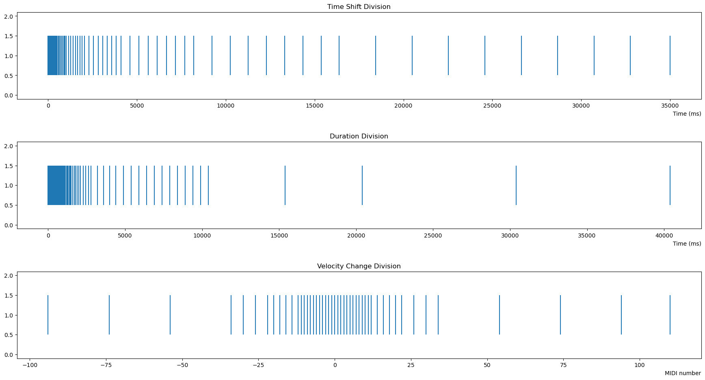
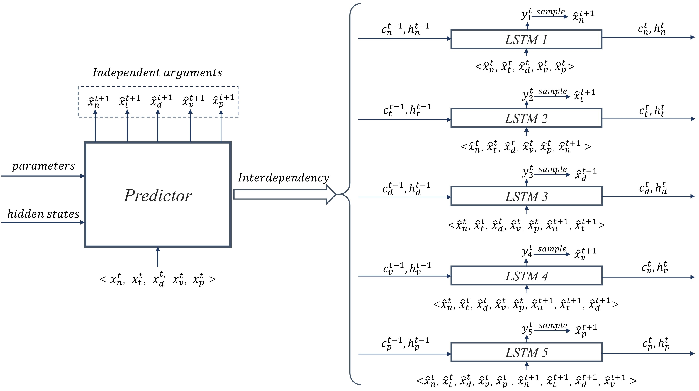
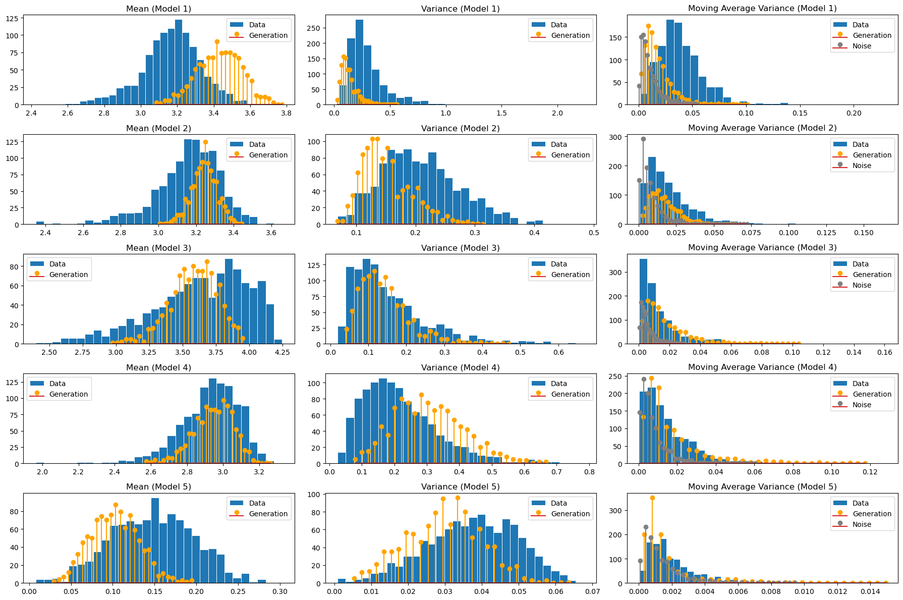

# Expressive Piano MIDI Generation

- Pre-prints [[paper1](https://hal.science/hal-05287022), [paper2](https://hal.science/hal-05287024), [paper3](https://hal.science/hal-05287026)] associated with ERC (European Research Council) Advanced Grant for [Project REACH: Raising Co-creativity in Cyber-Human Musicianship](http://repmus.ircam.fr/reach). IRCAM, France.
- [Video Demo on YouTube](https://www.youtube.com/watch?v=8nnAonkVY0g)
- Chapter 4 of my [Ph.D. dissertation](https://www.proquest.com/openview/581cd124d0c14930d566ba9010cecd67/1?pq-origsite=gscholar&cbl=18750&diss=y). The Ph.D. defense recording is [here](https://www.youtube.com/watch?v=Jzkn_w31lFA&list=PLRIfgTJKgMAoKh1kZnNjQaGCRggvxFUq4&index=4).

## Multi-Arguments I/O

Five arguments are extracted from the MIDI files as sufficient statistics for expressive piano performances. The five fields are:

- Note value ($n$): a MIDI note number in range $[21,108]$.
- Time shift ($t$): the onset difference between two subsequent notes in miliseconds, $t = 0$ gives perfectly simultaneous notes.
- Duration ($d$): duration of the note in miliseconds.
- Velocity ($v$): a number in range $[0,127]$, the MIDI default velocity representation.
- Sustain pedal ($p$): the status of the sustain pedal, with binary value on/off (1/0).

## Listening-based Data Processing

- *Abandonment of fixed grid.* Use time-shift events and duration measured in miliseconds to generate expressive timing.

- *A homogeneous treatment of monophony and polyphony.* We claim that there is no real simultaneity of notes. For any two notes that are played by a human performer, there is always a time discrepancy between them, no matter how unnoticeable it is. It means that, since there are no simultaneous events, **we can always place the notes in sequential order, by their time onsets.**

- *Not only the notes matter.* **The control events in MIDI may play a crucial role in musical expressivity** (eg. sustain pedal in piano generation). Please listen to "Original.MID" and "no_sustain.mid" for comparison.

- *Mel quantization of auditory features.* Instead of equal division, like the Mel spectrogram, we divide the ranges into uneven chunks to better reflect the perceptual truth. We refer to **Weber’s law** for just noticeable differences as our theoretical foundation for the divisions, where the noticeable difference is proportional to the current value.

<caption>
 Figure 1. The categorical distributions for given input features. The divisions obey Weber's law where the perceptual changes are proportional to the values. 
</caption>

## Multi-arguments Sequential Model

The temporal feature of the performance is captured by the sequential model, and the multi-arguments are inherently interdependent. To model their interdependencies, we decompose the temporal predictor into 5 separate LSTMs with inputs conditioned on previous outputs.

<caption>
 Figure 2. A way to Capture Interdependency among Arguments in a Multi-argument Sequential Model.
</caption>

## Generation Selection with Entropy Sequence

<caption>
 Figure 3. Statistics of Data and Generation Entropy Sequences of 5 LSTM Models.
</caption>

We propose several ways to select high quality generations from all generated samples. The main idea is to select generations with small entropy values regularized by the data statistics (making selected generation's entropy sequence close to data entropy sequences).

## Generated Samples

https://github.com/user-attachments/assets/c08daf21-da33-4914-a14c-59c1d49ef091

https://github.com/user-attachments/assets/4f42f421-1923-4868-b0f1-fc603613bbb9

https://github.com/user-attachments/assets/7ffcb28d-df20-446b-9564-15dc46aadbd6

https://github.com/user-attachments/assets/b2261933-c120-4217-b47b-fa9a8bf3714b

https://github.com/user-attachments/assets/7d66a694-43a6-417b-b30f-09012a36f789

https://github.com/user-attachments/assets/d22f65b5-028d-46b3-902e-56ddcbe155d2

https://github.com/user-attachments/assets/187e10d4-c5ca-4e0a-a972-bd686ff66884

